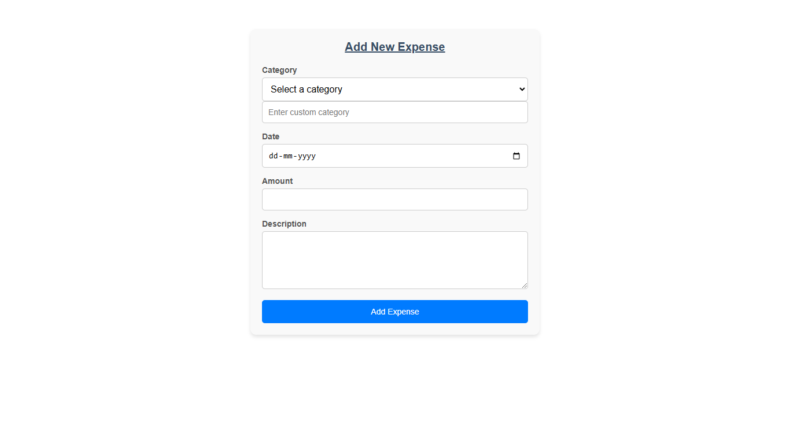

# Expense Tracker Frontend
<h1>Project Description</h1>

this app allows to interact with the backend services of expense tracker exist in my own gitHub repos. Recently this app has 3 pages home page fetch all expenses from the database, add page to add new expenses, update page to update the existing expense  and delete actions can be performed all this happen in real time and all changes will be refelct on UI as well as in the database 

